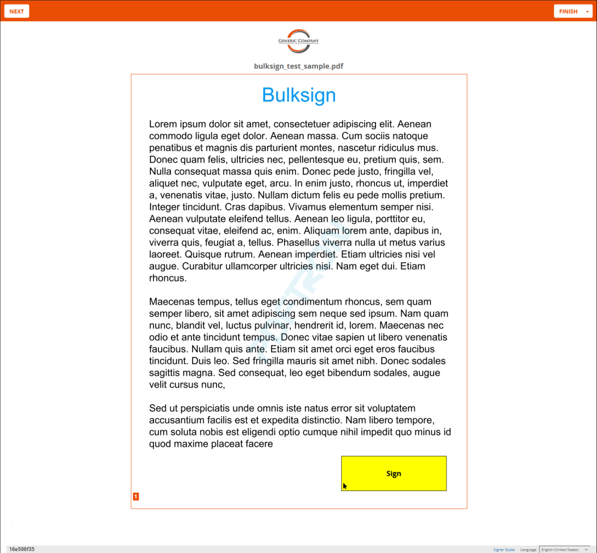
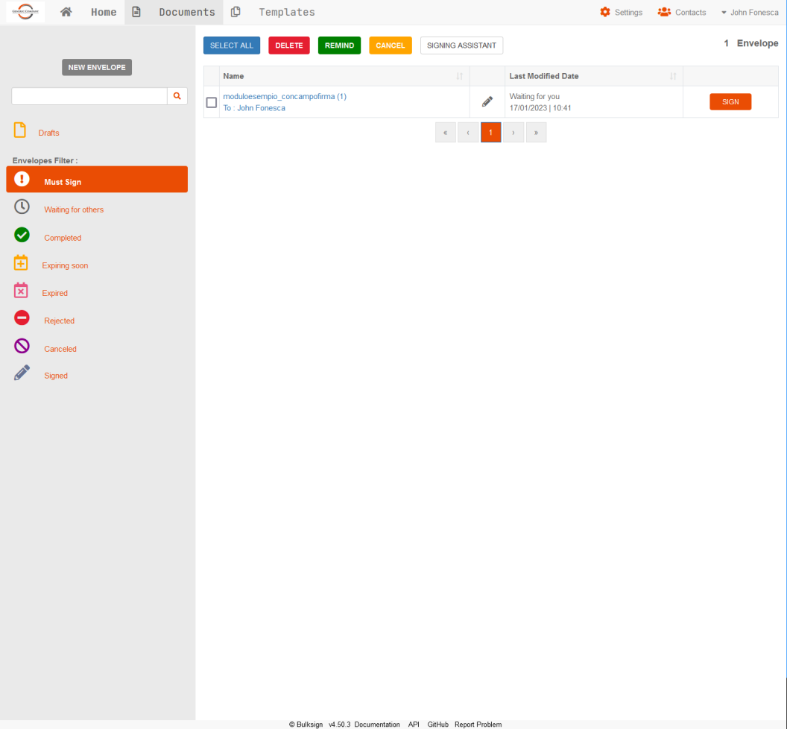

# Bulksign Visual Customization sample
This sample repository demonstrates CSS customization for Bulksign platform using a fictitious "Generic Company" organization.

### How can I use this ?

Log into Bulksign as a administrator and navigate to Settings \ Visual Customization.

- paste the content of the Dashboard.css file to the Dashboard CSS area.

- paste the content of the WebSign.css file to the WebSign CSS area.

- upload the organization logo from \images\orglogo.png

- save the changes

Here is how the customized signing experience looks like :
 
 

Here is how the customized dashboard looks like :
 
 

 
 

